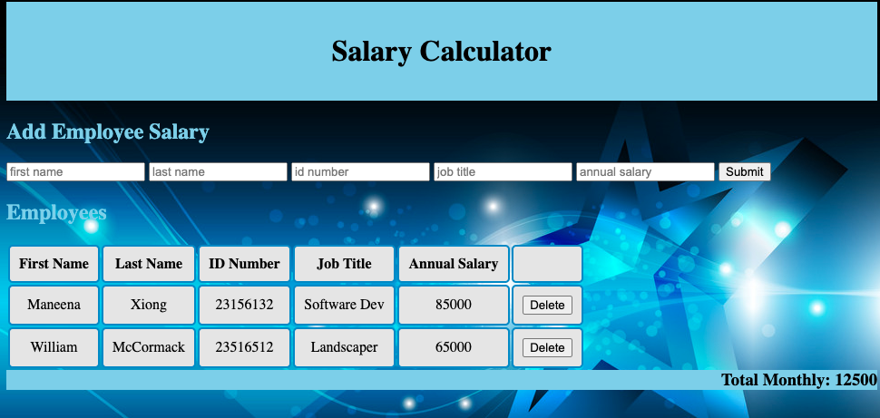

# Project Name

Project instructions
The application should have an input form that collects _employee first name, last name, ID number, job title, annual salary_.

A 'Submit' button should collect the form information, store the information to calculate monthly costs, append information to the DOM and clear the input fields. Using the stored information, calculate monthly costs and append this to the to DOM. If the total monthly cost exceeds $20,000, add a red background color to the total monthly cost.

Create a delete button that removes an employee from the DOM. For Base mode, it does **not** need to remove that Employee's salary from the reported total.

The problem I solved was getting the calculator to add up the salary and once it was over 20k the background of the Total Monthly will turn red. How I solved it was by using the if statements inside my calculatingRemaingMonthly function.

Additional README details can be found [here](https://github.com/PrimeAcademy/readme-template/blob/master/README.md).
